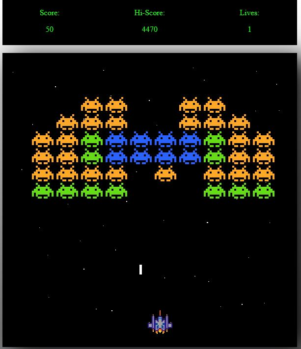

# Space Invaders - Javascript clone

This is a Javascript clone of the classic arcade shot'em up by Taito.
The code is based on [Youtuber, Coding With Adam](https://github.com/CodingWith-Adam/space-invaders)'s [video tutorial](https://www.youtube.com/watch?v=qCBiKJbLcFI).

## Improvements made on the tutorial's code:

- Player starting position centered
- Player bullets are removed when *completly* of the screen
- Enemy bullets are fired from the bottom, rather than the top, of the enemy
- Enemies trigger GameOver when reaching player base line, rather than collision

- Infinite play (game reset when Space down on GameOver screen)
- UI with score and Hi-Score tracking (10 points for every enemy death, score resets if lose)

- Lives tracking in UI (1UP every 1000 points, lose at 0 lives)
- Enemy shoot sound
- Enemy waves accelerate at each win, resets when lose, stays constant if enemies reach base.

- MotherShips spawn at random time and on random side; they fire at random times and are removed once they've crossed the screnn; they give random points, ten fold of grunts when hit
- Varying enemy points acording to color
Game-play now identical to original.

//- upgrade.js and upgradeController.js
//- UFO sound and death sound for motherShipController.js; classic moving sound for enemies

[Try it here](https://simonribeiro.github.io/Space-Invaders/)
