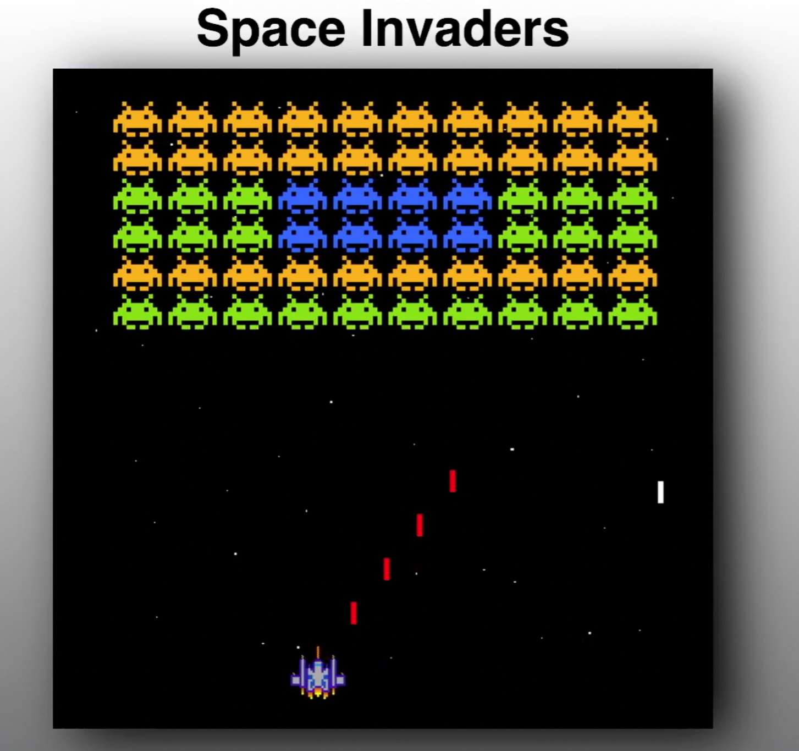

# Space Invaders - Javascript clone

This is a Javascript clone of the classic arcade shot'em up by Taito.
The code is based on [Youtuber, Coding With Adam](https://github.com/CodingWith-Adam/space-invaders)'s [video tutorial](https://www.youtube.com/watch?v=qCBiKJbLcFI).

## Improvements made on the tutorial's code:

- Player starting position centered
- Player bullets are removed when *completly* of the screen
- Enemy bullets are fired from the bottom, rather than the top, of the enemy

[Try it here](https://simonribeiro.github.io/Space-Invaders/)
